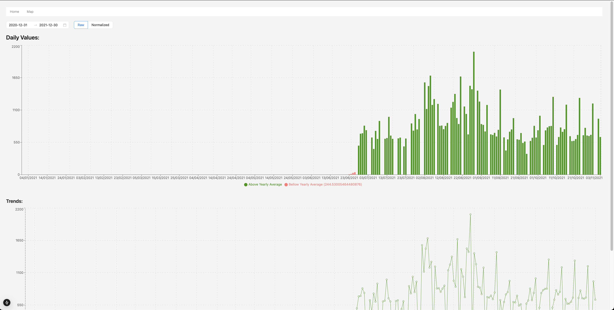
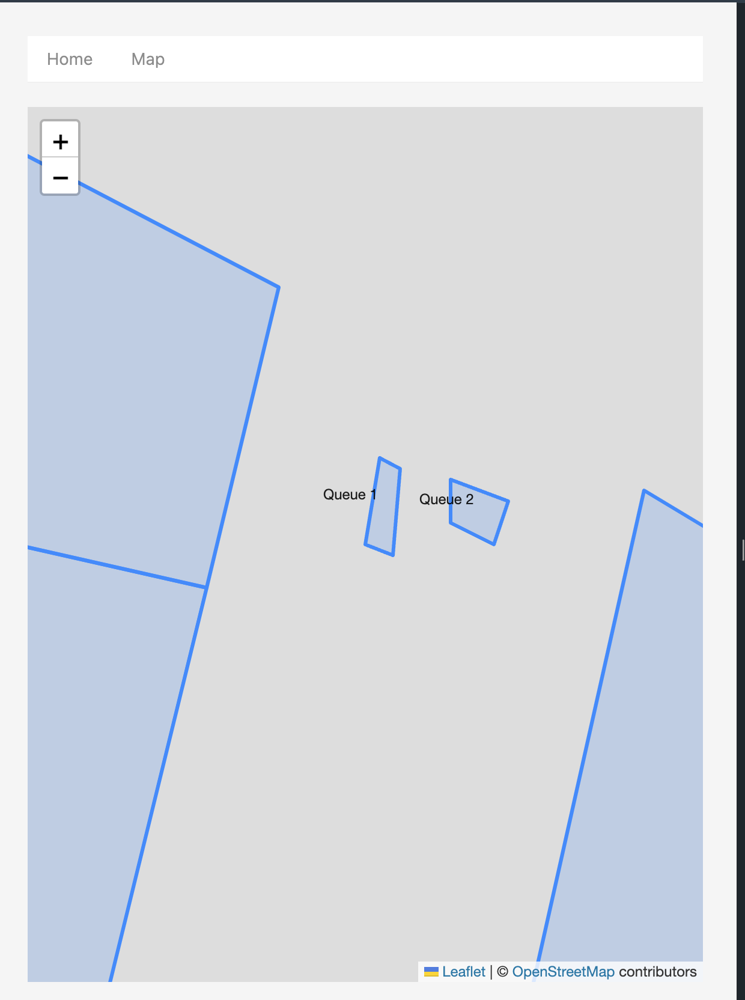

## Getting Started

Run the development server:

```bash
npm run dev
```

Opens [http://localhost:3000](http://localhost:3000) with your browser to see the result.

## Function
### Charts
On the home page (`http://localhost:3000/`), there're 2 charts to show daily values, and trends over chose date range

### Map
On the map page (`http://localhost:3000/map`), there is a map that displaying GeoJSON data with the location's names
